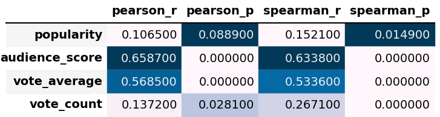
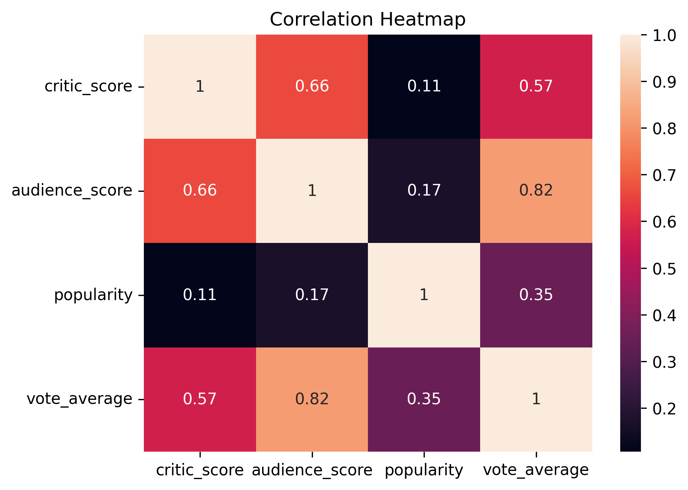
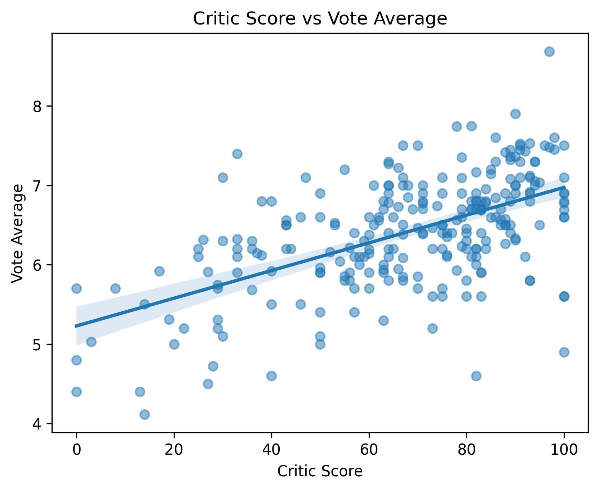
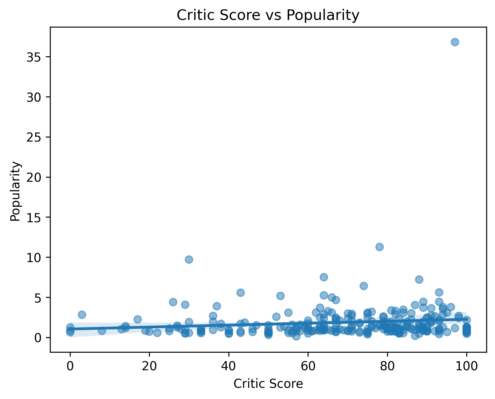

# Do Critics Matter? Analyzing the Relationship Between Critic Scores and Movie Popularity

## Contributors

- **Flynn Huynh** (fhuynh2) — Data acquisition, data cleaning, data integration, pipeline automation, Git repository management
- **Harlow Nguyen** (harlown2) — Data quality assessment, exploratory data analysis, visualizations, and finalize our write-up

---

## Summary

We believe film critics have long held an outsized influence over how movies are marketed and perceived by the public. Yet it remains unclear whether critical acclaim from them can reliably translate into a movie's broader popularity — the kind measured by public engagement rather than award recognition. Our project wishes to investigate whether critic scores are a meaningful predictor of movie popularity, using two complementary datasets: a Rotten Tomatoes dataset containing critic and audience scores sourced from r/datasets, and enriched movie metadata fetched live from The Movie Database (TMDB) REST API.

Our central research questions are:

1. **Is there a statistically meaningful correlation between a movie's critic score and its TMDB popularity score?**
2. **Do critically acclaimed movies (high critic score) tend to have higher vote counts and popularity, or does popularity operate independently of critical reception?**

To answer these questions, we built a fully automated end-to-end data pipeline covering acquisition, cleaning, integration, and analysis. The Rotten Tomatoes dataset provides `critic_score` and `audience_score` as percentage values across 12,413 movies spanning approximately 1970 to the present. The TMDB API provides `popularity`, `vote_count`, and `vote_average` — three distinct proxies for public engagement — for 700 matched movies fetched by querying RT titles against the TMDB `/search/movie` endpoint.

After cleaning both datasets — parsing inconsistent date formats, stripping percentage strings, normalizing titles, and deduplicating — we performed an inner join on normalized title and release year, producing a merged dataset of roughly **256 movies** with complete data across all key variables. The merged dataset covers films mostly from 1970 to 1973, a scope that arose from the sequential structure of the RT dataset and is documented as a known limitation.

> ***NOTE: There will be a different number of movies depending on when you run the script, since the TMDB database changes over time as more movies are added***

The project follows the USGS Science Data Lifecycle model: Plan -> Acquire -> Process -> Analyze -> Preserve -> Publish/Share. All code is organized into discrete, single-responsibility Python scripts (`acquire_rt.py`, `acquire_tmdb.py`, `clean.py`, `integrate.py`) in the `scripts` folder, chained together by `run_pipeline.sh`, enabling full reproducibility from a clean environment with a single command. We maintained Data Provenance by preserving raw inputs unmodified and logging all transformation decisions with row counts at each stage.

---

## Data Profile
 
### Dataset 1: Rotten Tomatoes Movie Scores (`datasets/movie_info.csv`)
 
| Attribute | Value |
|---|---|
| Source | [r/datasets](https://www.reddit.com/r/datasets/) (approved course source) |
| Original data provider | Rotten Tomatoes / Fandango Media |
| Format | CSV (flat tabular) |
| Access method | Programmatic download via Google Drive link (`acquire_rt.py`) |
| Raw size | 12,413 rows × 5 columns |
| Columns | `title`, `url`, `release_date`, `critic_score`, `audience_score` |
| Coverage | Movies from approximately 1970 to present |
| File location in repo | `datasets/movie_info.csv` |
 
**Column descriptions:**
 
| Column | Type | Description |
|---|---|---|
| `title` | String | Movie title as listed on Rotten Tomatoes |
| `url` | String | Full Rotten Tomatoes page URL for the movie |
| `release_date` | String | Release date in one of two inconsistent formats (see Data Cleaning) |
| `critic_score` | String (raw) -> Float (cleaned) | Tomatometer score as a percentage string, e.g. `"84%"` |
| `audience_score` | String (raw) -> Float (cleaned) | Audience score as a percentage string, e.g. `"75%"` |
 
**Relevance to research questions:** `critic_score` is the primary independent variable. It is used directly to investigate its relationship with TMDB popularity and vote counts.
 
**Ethical and legal considerations:** The dataset was shared publicly on r/datasets and references publicly accessible Rotten Tomatoes pages. Rotten Tomatoes does not provide an official public bulk data API, so this dataset is an unofficial third-party compilation. Per Rotten Tomatoes' Terms of Use, automated data extraction and redistribution may be restricted. Accordingly, our project uses the data strictly for non-commercial educational purposes, does not redistribute the raw file directly in the repository (it is downloaded programmatically at runtime), and treats findings as exploratory rather than authoritative. No personally identifiable information is present in the dataset.
 
---
 
### Dataset 2: TMDB Movie Metadata (`datasets/tmdb_movies.csv`)
 
| Attribute | Value |
|---|---|
| Source | [The Movie Database (TMDB)](https://www.themoviedb.org/) — REST API v3 |
| Format | JSON (fetched via API) -> CSV (saved by acquisition script) |
| Access method | HTTP REST API, `/search/movie` endpoint, registered API key required |
| Raw size | 700 rows × 7 columns |
| Columns | `id`, `title`, `release_date`, `vote_average`, `vote_count`, `popularity`, `overview` |
| Coverage | 700 matched records corresponding to RT titles, covering ~1970–2022 |
| File location in repo | `datasets/tmdb_movies.csv` |
 
**Column descriptions:**
 
| Column | Type | Description |
|---|---|---|
| `id` | Integer | TMDB unique movie identifier |
| `title` | String | Movie title as listed on TMDB |
| `release_date` | String | Release date in `YYYY-MM-DD` format |
| `vote_average` | Float | Average user rating on TMDB (0–10 scale) |
| `vote_count` | Integer | Total number of user ratings on TMDB |
| `popularity` | Float | TMDB composite popularity score (page views, watchlist additions, rating activity) |
| `overview` | String | Short plot summary from TMDB |
 
**Relevance to research questions:** `popularity` and `vote_count` serve as the primary dependent variables — proxies for public reach and audience engagement. `vote_average` provides an additional comparison point alongside `critic_score`.
 
**Ethical and legal considerations:** Data is collected in compliance with the [TMDB Terms of Use](https://www.themoviedb.org/terms-of-use), which permits non-commercial and educational use with attribution. Attribution is provided in the References section. The API key is stored securely in a local `.env` file and is never committed to the repository; a `.env.example` placeholder is committed instead. No personal data is involved in any TMDB API response used by this project. Flynn has added a `time.sleep(0.25)` delay between requests to comply with TMDB's rate limits (~40 requests/10 seconds).
 
---
 
### Integration Schema
 
Both datasets are joined on two shared attributes:
 
| Join Key | RT column | TMDB column | Transformation |
|---|---|---|---|
| Normalized title | `title` -> `title_clean` | `title` -> `title_clean` | Lowercase, punctuation removed, whitespace collapsed |
| Release year | `release_date` -> `release_year` | `release_date` -> `release_year` | Year extracted via regex (RT) or `dt.year` (TMDB) |
 
The merge uses `pandas.merge()` with `how='inner'`, producing only rows where both datasets agree on title and year. Original columns from both sources are retained in the merged output for full provenance traceability.
 
**Merged dataset location:** `datasets/merged_movies.csv` (256 rows × 12 columns)
 
---
 
## Data Quality
 
### Rotten Tomatoes (`movie_info.csv`)
 
| Issue | Detail |
|---|---|
| Missing `critic_score` | 3,036 rows (24.5%) have no critic score, predominantly older or limited-release films |
| Missing `audience_score` | 1,587 rows (12.8%) have no audience score |
| Missing `release_date` | 13 rows (0.1%) have no release date at all |
| Duplicate entries | 1,740 duplicate titles present; same movie appears multiple times with different or missing scores |
| Inconsistent date format | Two formats coexist: `"Released Dec 16, 1970"` and bare `"1970"` |
| Score format | `critic_score` and `audience_score` stored as strings with `%` suffix, not numeric |
 
**Overall completeness:** 12,413 raw rows; 8,105 rows retained after cleaning (65.3% retention rate).
 
### TMDB (`tmdb_movies.csv`)
 
| Issue | Detail |
|---|---|
| Missing `release_date` | 2 rows (0.3%) have no release date |
| Duplicate TMDB records | 101 duplicate entries by `id` caused by repeated title queries in the fetch script |
| Unmatched titles | 4 titles returned no TMDB result: `Hello.Goodbye`, `Bless the Beasts and Children`, `Who Killed Mary What's 'er Name?`, `Forty Carats` |
 
**Overall completeness:** 700 raw rows; 597 unique rows retained after cleaning (85.3% retention rate).
 
### Merged Dataset (`merged_movies.csv`)
 
| Metric | Value |
|---|---|
| Final row count | 256 rows |
| Match rate vs TMDB clean | ~42.9% (256 of 597 unique TMDB records matched an RT entry) |
| Missing values | 0 (all rows fully populated after final `dropna()`) |
| Temporal coverage | Predominantly 1970–1973 (233/256 rows); 23 rows from other years (1955–2022) due to TMDB returning alternate year versions of matched titles |
 
**Key quality limitation:** The merged dataset is constrained to 1970–1973 because `acquire_tmdb.py` fetches records by iterating from the top of the RT dataset, which is sorted chronologically. This limits temporal generalizability and is documented as a known scope limitation.
 
[**Harlow — please add any additional quality observations from your EDA here, e.g. outlier findings in `popularity` or `critic_score` distributions, skewness, or any anomalies you noticed during analysis.**]
 
---
 
## Data Cleaning
 
All cleaning is implemented in `clean.py` and operates on both raw datasets independently before integration.
 
### Rotten Tomatoes Cleaning Steps
 
**1. Score parsing — stripping `%` and casting to numeric**
 
`critic_score` and `audience_score` were stored as strings with a `%` suffix (e.g., `"84%"`). These were cleaned by stripping the `%` character with `str.replace()` and casting to float using `pd.to_numeric(..., errors='coerce')`. The `errors='coerce'` argument safely converts any remaining non-numeric values to `NaN` rather than raising an error, preserving pipeline stability.
 
**2. Release year extraction**
 
The `release_date` column used two inconsistent formats — `"Released Dec 16, 1970"` and bare `"1970"` — making standard `pd.to_datetime()` parsing unreliable. A regex pattern `\b(19|20)\d{2}\b` was applied to extract the 4-digit year from either format, stored in a new `release_year` column (integer). Rows where no year could be extracted were treated as missing.
 
**3. Title normalization**
 
A `normalize_title()` function was applied to create a `title_clean` column: convert to lowercase, remove all punctuation using `re.sub(r"[^\w\s]", "", t)`, and collapse multiple spaces to single spaces. This ensures consistent matching across the two datasets for titles that differ only in punctuation or casing (e.g., `"M*A*S*H"` -> `"mash"`).
 
**4. Dropping rows with missing required values**
 
Rows missing `critic_score`, `release_year`, or `title_clean` were dropped since these are required for both the merge key and the analysis. This removed 3,114 rows (25.1%).
 
**5. Deduplication**
 
After dropping missing values, 1,194 duplicate rows remained (same `title_clean` + `release_year`). These were resolved by sorting on `critic_score` descending and keeping only the first occurrence — i.e., the entry with the highest critic score per movie. This avoids data loss and ensures the most informative entry is retained.
 
**Final RT clean shape: 8,105 rows × 7 columns**
 
---
 
### TMDB Cleaning Steps
 
**1. Release year extraction**
 
TMDB's `release_date` is consistently formatted as `YYYY-MM-DD`, so `pd.to_datetime(..., errors='coerce').dt.year` was used to extract the year reliably. Two rows with missing dates were dropped.
 
**2. Title normalization**
 
The same `normalize_title()` function was applied to create `title_clean`, ensuring the join key is consistent with the RT dataset.
 
**3. Dropping rows with missing required values**
 
Rows missing `title_clean`, `release_year`, or `popularity` were dropped (2 rows removed).
 
**4. Deduplication on TMDB `id`**
 
Because `acquire_tmdb.py` iterates over every row in the RT dataset (including duplicates), the same TMDB movie was fetched multiple times. Deduplication on `id` removed 101 duplicate records, keeping only the first occurrence.
 
**Final TMDB clean shape: 597 rows × 9 columns**
 
---
 
### Integration Cleaning
 
After the inner merge, `integrate.py` performs a final `dropna()` to ensure the merged dataset contains no missing values in any column. This removed 3 rows that had a missing `audience_score`, resulting in the final analysis-ready dataset of **256 rows × 12 columns**.
 
---
 
## Findings

This section presents the results of the exploratory data analysis conducted on critic scores, audience scores, popularity, and vote averages. Visualizations and statistical correlation tests are used to evaluate whether critic assessments meaningfully relate to how films are received and consumed by general audiences.

### Statistical Correlation Tests
Table 1 reports both Pearson and Spearman correlation coefficients and their associated p-values for the relationship between critic score and each other variable.



> Table 1. Pearson and Spearman correlation coefficients (r) and p-values (p) for critic score versus popularity, audience score, vote average, and vote count. Significant results (p < 0.05) indicate relationships unlikely to be due to chance.

Audience score and vote average demonstrate the strongest and most reliable associations with critic score (Pearson r = 0.66 and 0.57, respectively; both p < 0.001). Vote count shows a weaker but statistically significant Spearman correlation (r = 0.27, p < 0.001), implying that more critically reviewed films may attract slightly more voter engagement. Popularity remains the weakest correlate: while the Spearman test achieves significance (p = 0.015), the correlation magnitude (r = 0.15) is negligible in practical terms.

### Correlation Heatmap
Figure 1 displays a Pearson correlation matrix across all four numerical variables.



> Figure 1. Pearson correlation heatmap for critic score, audience score, popularity, and vote average. Cell values report the correlation coefficient (r) for each variable pair. Warmer colors indicate stronger positive correlations; darker colors indicate weaker correlations.

The heatmap reveals a clear hierarchy of association strengths. The strongest correlation in the dataset is between **audience score and vote average (r = 0.82)**, indicating that the two audience-facing metrics capture closely related constructs. Critic score and audience score share a moderately strong relationship (r = 0.66), and critic score and vote average correlate at r = 0.57. In contrast, popularity correlates only weakly with all other variables — r = 0.11 with critic score, r = 0.17 with audience score, and r = 0.35 with vote average. This pattern suggests that popularity, as a measure of raw viewer volume, is driven by factors largely independent of ratings from either critics or general audiences.

### Distribution of Key Variables
Figure 2 presents histograms with kernel density estimates (KDE) for the four numerical variables: critic score, audience score, popularity, and vote average.


> Figure 2. Histograms with KDE curves for critic score, audience score, popularity, and vote average. Each plot shows the frequency distribution of films across the respective metric.

Critic scores are broadly distributed across the **0–100 range** with a slight left skew and a concentration in the 70–90 range, suggesting most films that receive critical attention are reviewed somewhat favorably. Audience scores display a more pronounced left skew, with the majority of films clustered in the **60–90 range**, indicating that audiences tend to rate films higher on average than critics. The popularity variable is heavily **right-skewed**, which is a pattern consistent with a "long tail" distribution typical of media consumption data. Vote averages follow a **near-normal distribution**, concentrated between 6 and 7, with very few films receiving extreme ratings at either end.

### Critic Score vs. Vote Average 
Figure 3 shows a scatter plot of critic score against TMDB vote average, with a linear regression trend line overlaid.



> Figure 3. Scatter plot of critic score (x-axis) versus vote average (y-axis), with a fitted OLS regression line and 95% confidence interval band. Each point represents an individual film.

There is a clear **positive relationship** between the two variables: as critic scores increase, vote averages tend to rise as well. The regression line indicates a meaningful but moderate relationship. Substantial scatter around the trend line indicates that critic scores alone do not fully determine audience ratings. Many films with moderate critic scores achieve high vote averages, and vice versa. Nevertheless, the overall directional relationship is consistent and statistically robust (Pearson r = 0.57, p < 0.001).

### Critic Score vs. Popularity
Figure 4 examines whether critical acclaim translates into viewership, as proxied by the popularity metric.



> Figure 4. Scatter plot of critic score (x-axis) versus popularity score (y-axis), with an OLS regression line and 95% confidence interval. Popularity is highly right-skewed, with most films clustered near the bottom of the y-axis.

The relationship between critic score and popularity is **very weak**. The regression line is nearly flat, and the confidence interval remains narrow, reflecting very little predictive power. A single outlier stands out, which is a film scoring near 100 on the critic scale and has a popularity score 35. Outside of this outlier, the data shows no appreciable upward trend. The Pearson r of 0.11 (p = 0.089) fails to reach conventional significance thresholds, and even the Spearman correlation (r = 0.15, p = 0.015) represents a negligible effect size. This suggests that critical scores have minimal influence on the number of people engaging with a film.

### Spread and Outliers in Critic Scores
Figure 5 provides a boxplot summarizing the central tendency, spread, and outliers within the critic score distribution.


> Figure 5. Boxplot of critic scores. The box spans the interquartile range (IQR, Q1–Q3), the central line represents the median, and whiskers extend to 1.5× IQR. Circles indicate outlier observations.

The interquartile range spans approximately 58 to 87, confirming that the middle 50% of films cluster in the upper half of the 0–100 scale. The median sits near 75, reinforcing the observation that critics tend to rate most reviewed films favorably. Three low-scoring outliers (below 10) are visible on the lower end, representing films that received exceptionally harsh critical assessments while still appearing in the dataset. The right whisker extends to the maximum value of 100, with no upper outliers, indicating that perfect critic scores are not statistically unusual given the overall distribution.

### Key Takeaways
Taken together, the findings from this analysis yield three conclusions regarding the research question — Do Critics Matter?

**1. Critics and Audiences Largely Agree.** Critic scores are meaningfully associated with how audiences rate films. Films that critics praise tend to earn higher viewer ratings, and films that score low among critics tend to score lower with audiences as well. In this sense, critics and audiences are broadly aligned.

**2. Critics Do Not Drive Viewership.** Despite the alignment in quality ratings, critic scores have little to no influence on a film's popularity. The near-zero correlation between critic score and popularity indicates that critical acclaim is insufficient for a film to achieve large-scale viewership. Other factors, such as appeal, marketing budgets, franchise recognition, and audience demographics appear to play a more important role in driving popularity than critical assessment.

**3. Popularity Follows a "Long Tail" Dynamic.** A small number of films attract disproportionate attention regardless of critical merit, while the vast majority of even well-reviewed films attract modest audiences. This winner-takes-all dynamic is consistent with known patterns in media consumption.

In summary, critics matter for quality perception, but critics do not matter for popularity. Whether a film becomes widely watched is determined by forces that operate largely independently of critical evaluation. 
 
---
 
## Future Work [**(Harlow - Ờm I lowkey need ur help here, please change or edit whatever sounds weird)**]

Future work could investigate the role of genre, release platform, marketing spend, and franchise status as moderating variables in the critic score–popularity relationship.

This project represents a focused first pass at understanding the critic score–popularity relationship using a limited but clean dataset. Several directions would meaningfully extend its scope and rigor.
 
**Broader temporal coverage.** The most significant limitation is that the merged dataset covers only 1970–1973 films. This arose because `acquire_tmdb.py` iterates from the top of the RT dataset, which is chronologically sorted. A future iteration should either shuffle the RT titles before fetching, or target a stratified sample across decades, to produce a dataset spanning the full 1970–present range of the RT source. This would make decade-level trend analysis — one of our original research questions — actually feasible.
 
**Fuzzy title matching.** The current integration strategy uses exact normalized title matching, which fails for titles that differ in more substantive ways (e.g., foreign language versions, subtitles, or sequels with slight name variations). Implementing fuzzy matching using the `recordlinkage` library or Levenshtein distance would increase the match rate and reduce selection bias toward movies with clean, consistent naming.
 
**Richer TMDB features.** The `/search/movie` endpoint returns only summary fields. The `/movie/{id}` detail endpoint provides budget, revenue, runtime, and spoken language data which would enable more sophisticated analysis — for example, whether big-budget films show a different critic–popularity relationship than low-budget ones.
 
**Formal statistical modeling.** The current scope is limited to exploratory correlation analysis. Future work could apply simple linear regression, controlling for confounders such as release decade, vote count (as a proxy for film visibility), and TMDB's `vote_average` to isolate the independent effect of critic scores on popularity.
 
**Genre-level analysis.** TMDB returns `genre_ids` as integer codes. With an additional lookup against the `/genre/movie/list` endpoint, genre labels could be decoded and used as a grouping variable to investigate whether the critic–popularity relationship differs systematically by genre (e.g., art films vs. blockbusters).
 
**Automated provenance logging.** Currently, provenance is captured through terminal print statements and documentation. A more rigorous approach would log input file checksums (SHA-256), row counts at each pipeline stage, and transformation decisions to a structured JSON log file, creating a machine-readable audit trail alongside the human-readable report.
 
---
 
## Challenges
 
**Inconsistent `release_date` formats in the RT dataset.** The `release_date` column used two coexisting formats — `"Released Dec 16, 1970"` and a bare year `"1970"` — with no consistent separator. Standard `pd.to_datetime()` failed on both. This was resolved with a regex extractor targeting any 4-digit year matching `(19|20)\d{2}`, which handled both formats robustly without hard-coding format strings.
 
**Duplicate entries from the RT dataset are propagating into TMDB fetches.** The RT dataset contains multiple rows for many movies (e.g., *The Aristocats* appears several times with and without scores, *The French Connection* appears four times). Because `acquire_tmdb.py` iterates over every row, these duplicates resulted in 101 repeated TMDB records in the raw fetch output. This required a two-stage deduplication strategy: RT duplicates resolved by retaining the highest `critic_score` per title+year, and TMDB duplicates resolved by deduplicating on `id`.
 
**Score columns stored as non-numeric strings.** `critic_score` and `audience_score` were stored as strings with a `%` suffix. While straightforward to fix once identified, this meant that initial attempts to compute statistics or correlations on the raw data silently failed or produced string-sorting behavior rather than numeric comparisons. The fix — `str.replace('%', '').astype(float)` with `errors='coerce'` — is now encapsulated in `clean.py`.
 
**Merged dataset predominantly limited to 1970–1973.** Because the TMDB fetch starts from row 0 of the RT dataset (sorted chronologically), 233 of 256 merged records cover films from 1970–1973. An additional 23 rows from scattered other years (1955–2022) appeared due to TMDB returning a different year's version of a matched title — a known side effect of title-only search queries. This limits temporal generalizability and is documented as a known scope limitation.
 
**API key security and reproducibility tension.** The TMDB API requires a registered key that cannot be committed to the repository. This creates a reproducibility gap: the pipeline cannot run without a key, but the key cannot be shared. This was resolved through the `.env` + `.env.example` pattern, with clear instructions in this README for obtaining a free key. The Google Drive download strategy for the RT dataset similarly resolves the reproducibility gap for that source.
 
---
 
## Reproducing
 
Follow these steps to reproduce the full pipeline from a clean environment.
 
### Prerequisites
 
- Python 3.8 or higher
- `pip` or `pip3`
- A free TMDB API key (see instructions below)
- A Google account (to access the RT dataset via Google Drive)
### Step 1: Obtain a TMDB API Key
 
1. Create a free account at [https://www.themoviedb.org/signup](https://www.themoviedb.org/signup)
2. Log in and navigate to **Settings -> API** ([direct link](https://www.themoviedb.org/settings/api))
3. Click **"Request an API Key"** and select **"Developer"**
4. Fill in the required form (project name: e.g. "IS477 Course Project", ...)
5. Your **API Key (v3 auth)** will be displayed — copy it
### Step 2: Clone the Repository
 
```bash
git clone https://github.com/YOUR_USERNAME/YOUR_REPO.git
cd YOUR_REPO
```
 
### Step 3: Set Up Python Environment
 
```bash
python3 -m venv venv
source venv/bin/activate        # on Windows: venv\Scripts\activate
pip install -r requirements.txt
```
 
### Step 4: Configure Environment Variables
 
```bash
cp .env.example .env
```
 
Open `.env` and fill in your values:
 
```
TMDB_API_KEY=your_actual_tmdb_api_key_here
RT_ZIP_URL=https://drive.google.com/file/d/12IpMErb4j83h5gGTdTpv0WZOf5ceY7b3/view?usp=sharing
```
 
### Step 5: Fix Script Paths (Important)
 
> **Note:** The scripts (`acquire_rt.py`, `acquire_tmdb.py`, `clean.py`, `integrate.py`) must be located in a `scripts/` subdirectory for `run_pipeline.sh` to find them. Move them if they are currently at the repo root:
>
> ```bash
> mkdir -p scripts
> mv acquire_rt.py acquire_tmdb.py clean.py integrate.py scripts/
> ```
 
### Step 6: Run the Full Pipeline
 
```bash
bash run_pipeline.sh
```
 
This will execute the following steps in order:
 
| Step | Script / Notebook | Input | Output |
|---|---|---|---|
| 1 | `scripts/acquire_rt.py` | Google Drive URL | `datasets/movie_info.csv` |
| 2 | `scripts/acquire_tmdb.py` | `datasets/movie_info.csv` + TMDB API | `datasets/tmdb_movies.csv` |
| 3 | `scripts/clean.py` | Both raw CSVs | `datasets/rt_clean.csv`, `datasets/tmdb_clean.csv` |
| 4 | `scripts/integrate.py` | Both cleaned CSVs | `datasets/merged_movies.csv` |
| 5 | `analysis.ipynb` (via `nbconvert`) | `datasets/merged_movies.csv` | Figures and analysis results |
 
> **Note on runtime:** Step 2 (TMDB acquisition) fetches 700 records with a 0.25s delay between requests. Expect approximately 3–5 minutes to complete. Step 5 requires `jupyter` — the pipeline warns and skips gracefully if not found, in which case run the notebook manually with `jupyter notebook analysis.ipynb`.
 
### Expected Output Files
 
```
datasets/
├── movie_info.csv          # Raw RT dataset (downloaded by acquire_rt.py)
├── tmdb_movies.csv         # Raw TMDB data (fetched by acquire_tmdb.py)
├── rt_clean.csv            # Cleaned RT data (8,105 rows)
├── tmdb_clean.csv          # Cleaned TMDB data (597 rows)
└── merged_movies.csv       # Final integrated dataset (256 rows)
```
 
---
 
## References
 
**Datasets:**
 
- Rotten Tomatoes movie scores dataset, shared by community contributor on r/datasets (Reddit). Retrieved from: [https://www.reddit.com/r/datasets/](https://www.reddit.com/r/datasets/). Original data Fandango Media / Rotten Tomatoes. Used for non-commercial educational purposes only.
- The Movie Database (TMDB) API v3. The Movie Database. [https://www.themoviedb.org/](https://www.themoviedb.org/). This product uses the TMDB API but is not endorsed or certified by TMDB.
**Software and Libraries:**
 
- Python Software Foundation. *Python Language Reference*, version 3.x. [https://www.python.org/](https://www.python.org/)
- McKinney, W. et al. *pandas: powerful Python data analysis toolkit*. [https://pandas.pydata.org/](https://pandas.pydata.org/)
- *Requests: HTTP for Humans*. [https://requests.readthedocs.io/](https://requests.readthedocs.io/)
- *python-dotenv*. [https://github.com/theskumar/python-dotenv](https://github.com/theskumar/python-dotenv)
- *tqdm: A Fast, Extensible Progress Bar*. [https://tqdm.github.io/](https://tqdm.github.io/)
**Course Materials:**
 
- IS477: Data Management, Curation, and Reproducibility. School of Information Sciences, University of Illinois Urbana-Champaign.
- USGS Science Data Lifecycle Model. U.S. Geological Survey. [https://www.usgs.gov/data-management/data-lifecycle](https://www.usgs.gov/data-management/data-lifecycle)
