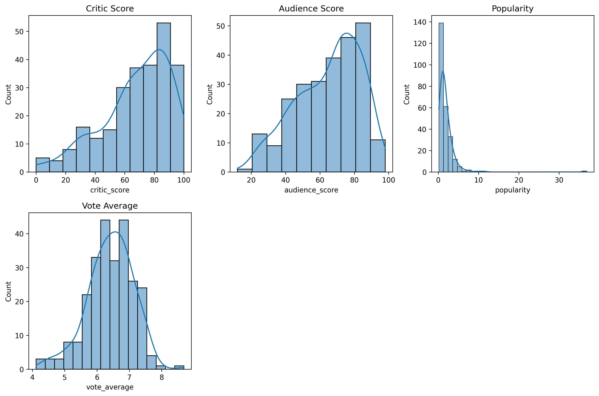
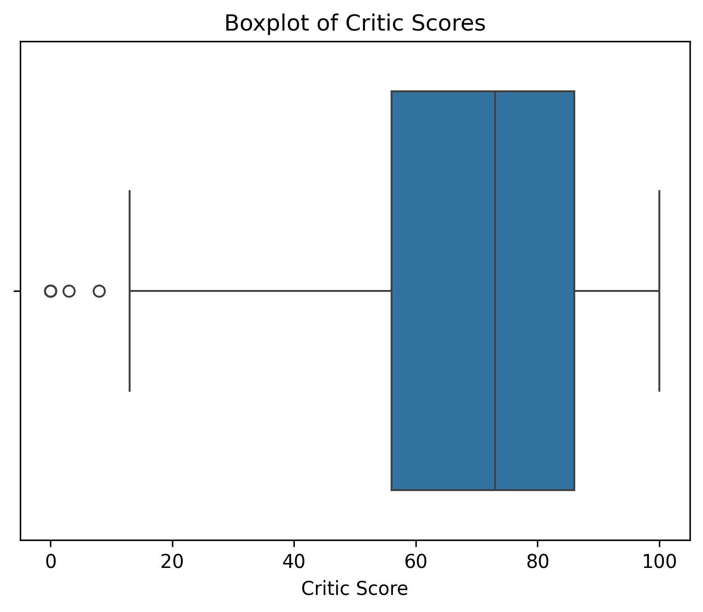

# Projects and Coursework

A collection of data science and machine learning projects completed as part of my coursework at the **University of Illinois**.

Each project follows a full data science workflow applied to a real, publicly available dataset. Some are individual coursework projects; others are **team collaborations** built with shared Git workflows, divided responsibilities, and joint write-ups.

## Topics Covered

- Data Cleaning & Preprocessing
- Exploratory Data Analysis (EDA)
- Data Visualization & Storytelling
- Statistical Correlation Analysis
- Linear Regression
- Classification
- Decision Trees
- K-Nearest Neighbors
- Model Evaluation & Hyperparameter Tuning
- Reproducible Data Pipelines
- Team-Based Data Science Workflows

## Projects

| Project | Type | Description | Techniques | Result |
|---|---|---|---|---|
| [**Do Critics Matter? Movie Ratings Analysis**](./Movie-Ratings-Analysis) | 👥 Team (2) | A collaborative project investigating whether critic scores predict a movie's popularity, combining a Rotten Tomatoes dataset with live TMDB API data through a fully reproducible pipeline. | EDA, correlation analysis (Pearson/Spearman), data visualization, reproducible pipelines | See [Visualization Highlights](#visualization-highlights) below |
| [**Credit Card Fraud Detection**](./Fraud-Prediction) | Solo | Detects fraudulent credit card transactions in a highly imbalanced dataset (0.58% fraud rate) using anonymized, PCA-transformed features. | Decision Tree Classifier, GridSearchCV, F₂ Score optimization | 92.9% precision, 82.3% recall |
| [**Wine Quality Prediction**](./Wine-Quality-Prediction) | Solo | Predicts the quality score of Portuguese *Vinho Verde* wines from their chemical properties, replacing subjective sommelier tasting with a data-driven model. | K-Nearest Neighbors, GridSearchCV, one-hot encoding | 0.476 Mean Absolute Error |

Each project folder contains its own `README.md` with full details on the dataset, methodology, and results, plus a `Report.ipynb`/`Report.html` walkthrough and the underlying model notebook.

## Teamwork Spotlight: Movie Ratings Analysis

This project was completed with a partner, **Flynn Huynh**, as part of a course on data management and reproducibility. We split ownership across the full data lifecycle rather than dividing work arbitrarily by file:

| Contributor | Role |
|---|---|
| **Flynn Huynh** | Data acquisition (Rotten Tomatoes + TMDB API), data cleaning, data integration, pipeline automation (`run_pipeline.sh`), Git repository management |
| **Harlow Nguyen** (me) | Data quality assessment, exploratory data analysis, all visualizations, and finalizing the written report |

Working as a team meant agreeing on a shared schema before either of us wrote analysis code, tracking data provenance so both of our pipeline stages stayed reproducible for the other person, and reviewing each other's findings before they made it into the final write-up. The result was a single coherent research narrative — "Do critics matter?" — built from verifiable work.

## Visualization Highlights

The Movie Ratings Analysis project leans heavily on visual storytelling to answer its research question. A few highlights from the analysis:

<table>
<tr>
<td width="50%">

**Correlation Heatmap**


Shows audience score and vote average as the strongest pair (r = 0.82), with popularity standing apart as only weakly related to critic or audience scores.

</td>
<td width="50%">

**Distribution of Key Variables**



Reveals popularity's heavily right-skewed "long tail," in contrast to the near-normal spread of vote averages.

</td>
</tr>
<tr>
<td width="50%">

**Critic Score vs. Popularity**


A near-flat regression line visually confirms that critical acclaim barely moves the needle on popularity.

</td>
<td width="50%">

**Critic Score Spread**



A boxplot summarizing the central tendency and outliers in how critics score films overall.

</td>
</tr>
</table>

Together, these plots turn a set of correlation coefficients into an intuitive story — critics and audiences broadly agree on quality, but that agreement has little bearing on what actually becomes popular. See the [full write-up](./Movie-Ratings-Analysis/README.md#findings) for the complete analysis, statistical tests, and takeaways.

## Repository Structure

```
Projects-and-Coursework/
├── Fraud-Prediction/
│   ├── Model.ipynb          # Model development notebook
│   ├── Report.ipynb          # Full write-up / analysis
│   ├── Report.html           # Rendered report
│   ├── requirements.txt
│   └── README.md
├── Movie-Ratings-Analysis/   # Team project (2 contributors)
│   ├── scripts/               # acquire_rt.py, acquire_tmdb.py, clean.py, integrate.py
│   ├── datasets/              # Raw, cleaned, and merged CSVs
│   ├── figures/                # Correlation heatmap, distributions, scatter plots, boxplots
│   ├── analysis.ipynb          # EDA & visualization notebook
│   ├── run_pipeline.sh         # One-command reproducible pipeline
│   ├── requirements.txt
│   └── README.md
├── Wine-Quality-Prediction/
│   ├── Model2.ipynb
│   ├── Report.ipynb
│   ├── Report.html
│   ├── requirements.txt
│   └── README.md
└── README.md                 # You are here
```

## Getting Started

Clone the repository:

```bash
git clone https://github.com/HarlowNg/Projects-and-Coursework.git
cd Projects-and-Coursework
```

Each project is self-contained with its own dependencies. To run a specific project, `cd` into its folder and install its requirements:

```bash
cd Fraud-Prediction        # or Wine-Quality-Prediction
pip install -r requirements.txt
jupyter notebook
```

Datasets are downloaded automatically by the notebooks — no manual download needed.

For **Movie-Ratings-Analysis**, the full pipeline (acquisition → cleaning → integration → analysis) can be reproduced with one command; see the [project README](./Movie-Ratings-Analysis/README.md#reproducing) for setup details, including obtaining a free TMDB API key:

```bash
cd Movie-Ratings-Analysis
pip install -r requirements.txt
bash run_pipeline.sh
```

## Tools & Technologies

- **Language:** Python
- **Libraries:** NumPy, Pandas, Scikit-learn, Matplotlib, Seaborn, PyArrow, Requests, python-dotenv
- **Environment:** Jupyter Notebook / JupyterLab
- **Collaboration:** Git/GitHub for version control and shared pipeline development

## About

These projects were built to demonstrate practical, end-to-end data science skills, including handling imbalanced data, tuning models with cross-validation, choosing evaluation metrics appropriate to the problem, building reproducible pipelines, communicating findings through clear visualizations, and collaborating effectively as part of a team.
